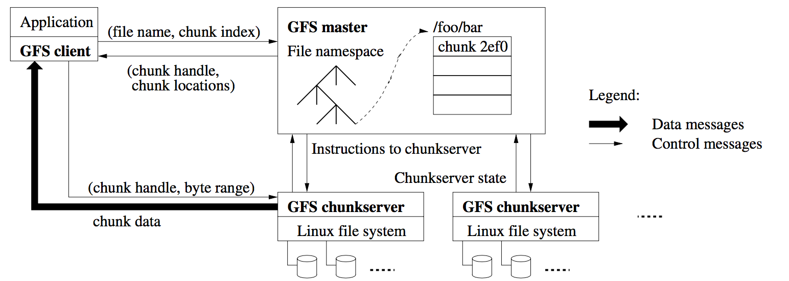

***本页还在构建中***

[论文地址](http://static.googleusercontent.com/media/research.google.com/en/us/archive/gfs-sosp2003.pdf)

# GFS的两个重要假设：

- 文件很大
- 不支持update，只支持append

# GFS的体系结构

{:width="800px"}

- master（可以有备份）和多个chunk server
- 文件被分成固定大小的chunk, 保存在chunk server上
- master存储metadata
